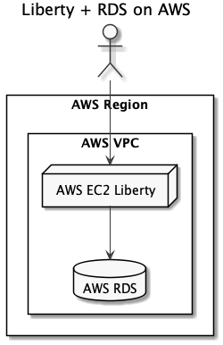

# exercisedb

## Development

### Start PostgreSQL locally

```
podman run -it --rm --ulimit memlock=-1:-1 \
           --name postgres \
           -e POSTGRES_USER=dbuser1 \
           -e POSTGRES_PASSWORD=password \
           -e POSTGRES_DB=database1 \
           -p 5432:5432 \
           postgres
```

### Run in the foreground 

```
mvn clean liberty:run
```

(stop with Ctrl+C)

Browse to [http://localhost:9080/exercisedb/](http://localhost:9080/exercisedb/)

### Package and run

1. `mvn clean package`
2. Upload `exercisedb-ear/target/exercisedb-ear.zip`
3. `unzip exercisedb-ear.zip`
4. `vi wlp/usr/servers/exercisedbServer/bootstrap.properties`
   ```
   HTTP_PORT=9080
   HTTPS_PORT=9443
   DB_HOST=...
   DB_PORT=...
   DB_NAME=...
   DB_USER=...
   DB_PASS=...
   MAXRUNNERTHREADS=100
   ```
5. `wlp/bin/server start exercisedbServer`

Example deployment architecture:


